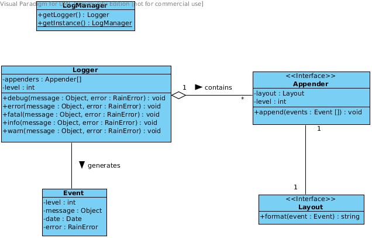

=======
Logging
=======

A vital feature for a distributed platform is a logging system that allows developers to easily
inspect and debug live deployments. RAIN provides a logging system created not only to serve the
platform's needs but also the custom needs of component developers. It's architecture is inspired
by the successful log4x library. Reasons for this choice include general programmer familiarity
with the library and a proven design. Features of RAIN's logging system include: custom component
loggers, useful appenders and layouts provided off-the-shelf, support for defining custom appenders
and layouts, complete JSON-based configuration.

--------
Overview
--------

The logging system is comprised of *loggers*, *appenders* and *layouts*. Connecting these togheter
through configuration gives developers great flexibility in specifying their output targets. Mixins
are provided that developers can use for creating custom implementations for appenders or layouts.
In addition, several implementations are provided by the platform. RAIN provides one **platform
logger** and developers have the possibility of *extending it* through a **component logger** for
their particular needs. In this way there is only one logger, but it can have an extended set of
appenders for each component.

.. note::
    Component loggers always extend the platform logger so any message logged at component level
    also gets logged at platform level.

RAIN's logging system defines 5 log levels. From the weakest to the strongest, these are:

    * ``DEBUG``
    * ``INFO``
    * ``WARN``
    * ``ERROR``
    * ``FATAL``

Here is an overview of the interfaces and classes available as part of the logging system. They will
be detailed in the following sections.

-------------
Configuration
-------------

As mentioned, configuring the logging system is possible at both the server (*server.conf.default*)
and component (*meta.json*) levels. The server configuration specifies the platform logger and
at component level developers can extend it with custom appenders and layouts available to their
component only.

Configuration is done inside the *logger* key. We will first see a complete example to get
familiar with the available options and then describe each component of the logging system in
detail. This is how a platform logger would be defined in the *server.conf.default* file::

    // ...
    logger: {
        level: 'info',
        appenders: [{
            type: 'console',
            layout: {
                type: 'pattern',
                params: {
                    'pattern': '%date %-5level %20.20logger - %message'
                }
            }
        }]
    }

The configuration specifies a platform logger that only logs messages having an *INFO* or above
level. The only appender the logger has is a *console* appender which uses a *pattern* layout.
The console appender as well as the pattern layout are provided by the platform.

Extending the platform logger for a component that needs a custom appender is easily achieved
through a similar configuration inside the component's *meta.json* file::

    // ...
    logger: {
        appenders: [{
            level: 'error',
            type: 'file',
            layout: {
                type: 'pattern',
                params: {
                    pattern: '%date - %message%newline%stacktrace'
                }
            },
            params: {
                file: 'logs/error.log'
            }
        }]
    }

This component logger configuration extends the platform logger with a *file* appender that only
logs messages having an *ERROR* level or above. The versatile pattern layout is used again, but
notice the appender *params* key. Some appenders define custom parameters such as in this case
where the log file path is specified.

An important observation is that the appenders themselves may have a level defined (as was done
with the file appender in the example above). This level acts as a threshold for that particular
appender, filtering out messages that have a lower level.

Moreover, component logger configurations aren't allowed to redefine the general logger level,
because this setting must only be configurable by the platform administrator.

.. note::
    Any appender that doesn't have a level specified will inherit the platform logger level. This
    behavior is usually not desired for custom component appenders, because it means the logging
    level may fluctuate as the platform administrator tweaks the general level setting. It is thus
    usually best to define levels for all custom component appenders.

Logging an INFO message with this example component logger will send the message to the platform
console appender, since that one inherits the level from the logger, but it will not send it to
the component file appender, since that one has a level threshold of ERROR. Naturally, logging
an ERROR or FATAL message will send it to both appenders.

-------
Loggers
-------

